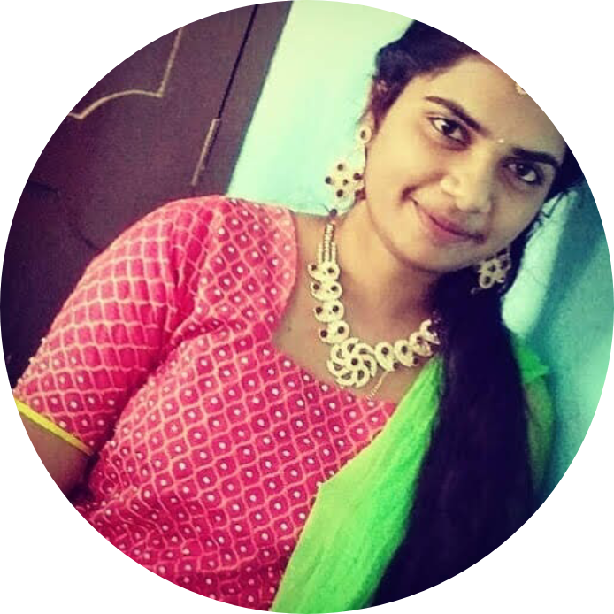
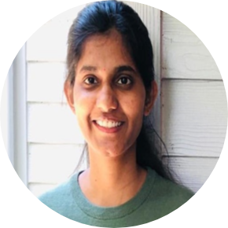

# D01-Introductions
## 1.Preferred name: Akanksha 
## 2.Current degree: Masters is Applied Computer Science
## 3.Past experience: worked with GitHub
## 4.Future plans: To work as a full stack developer
## 5.LinkedIn profile: https://www.linkedin.com/in/akanksha-goud-aa0ab8211/
## 6.GitHub profile:https: //github.com/S542046
### 7.Photo:   

# D01-Introductions
### Preferred name : shivani
### Current degree: masters in ACS
### Past experience: worked on github
### Future plans : planning to work as full stack developer
### LinkedIn profile: https://www.linkedin.com/in/shivani-tangellapally-a003601b5/
### GitHub profile:  https://github.com/shivani-ta
### Photo :  

# D01-Introductions
* Preferred name : Vasavi
*  Current degree: Masters in ACS
*  Past experience: Worked as a Software Developer i Virtusa.
*  Future plans : Planning to work as FullStack Developer
*  LinkedIn profile: https://www.linkedin.com/in/sri-vasavi-vipparla-22ba81126/
*  GitHub profile:https://github.com/Srivasavi-vipparla
*  Photo :  

# D01-Introductions
### Preferred name : Vivek
### Current degree: masters in ACS
### Past experience: worked on github.
### Future plans : My aim is to work as an App developer.
### LinkedIn profile: https://www.linkedin.com/in/vivektadiparthi/
### GitHub profile:  https://github.com/vivektadiparthi
### Photo :  

# Preferred name : vamshi
### Current degree: masters in ACS
### Past experience: worked as ETL Developer for 3 years at Tech Mahindra
### Future plans : planning to work as full stack developer
### LinkedIn profile: https://www.linkedin.com/in/vamshi-thirunagari-73944077/
### GitHub profile: https://github.com/vammshiee
### Photo :  
